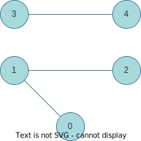

# Connected Components
Takes an appropriately formatted txt file, translates an undirected, unweighted graph into an adjacency matrix, and outputs the number of connected components within the graph.

[](https://www.java.com/en/) [](https://shields.io/) [](https://shields.io/) [](https://img.shields.io/badge/os-macOS-green.svg) [](https://github.com/sammurraytuesta)

<!-- TABLE OF CONTENTS -->
<details>
  <summary>Table of Contents</summary>
  <ol>
    <li>
      <a href="#Program-Specification">Program Specification</a>
      <ul>
        <li>
          <a href="#Input-File-Specification">Input File Specification</a>
          <ul>
            <li><a href="#Sample-Input">Sample Input</a></li>
          </ul>
        </li>
        <li><a href="#Adjacency-Matrix">Adjacency Matrix</a></li>
        <li><a href="#Graph-Visualization">Graph Visualization</a></li>
        <li><a href="#Sample-Invocation">Sample Invocation</a></li>
      </ul>
    </li>
    <li><a href="#Thank-You">Thank You!</a></li>
  </ol>
</details>

## Program Specification
This program takes a single command line argument specifying a filename. The given file adheres to the format specified below. The program then reads the file to create an adjacency matrix representation of the graph and computes and prints the number of connected components in the graph.

### Input File Specification
Nodes in this undirected graph are numbered sequentially from 0..|V|. The first line of the file contains a single integer, specifying the number of |V|, and each remaining line in the file contains two integers indicating that an edge exists between the two nodes.

#### Sample Input
The sample input.txt is provided and formatted accordingly:
```
5
0 1
3 4
1 2
```

### Adjacency Matrix
From the sample input.txt, the following adjacency matrix is created and used to determine the number of connected components in the graph using a depth first search graph analysis algorithm. 
|   | 0 | 1 | 2 | 3 | 4 |
|---|---|---|---|---|---|
| 0 | 0 | 1 | 0 | 0 | 0 |
| 1 | 1 | 0 | 1 | 0 | 0 |
| 2 | 0 | 1 | 0 | 0 | 0 |
| 3 | 0 | 0 | 0 | 0 | 1 |
| 4 | 0 | 0 | 0 | 1 | 0 | 

### Graph Visualization
The following graph is a visual representation of the data provided. This shows the "connectedness" of the components. From this visualization we can see that the expected output is 2 (the number of structures formed due to node connections).



### Sample Invocation
Compile and run the program with a single command line argument specifying a filename. The program will return the number of connected components. In this case the output is 2 given the sample input.txt file.
```
$ javac Components.java
$ java Components input.txt
2
```

## Thank You!
Enjoy Connected Components!
